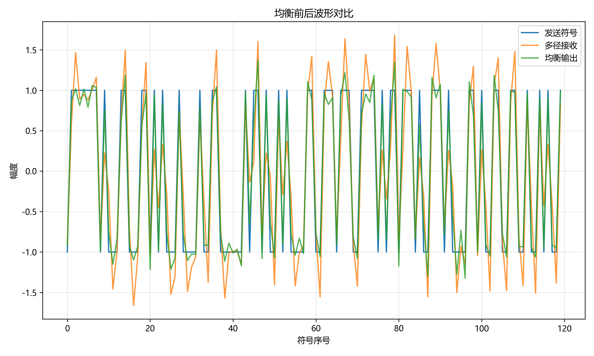
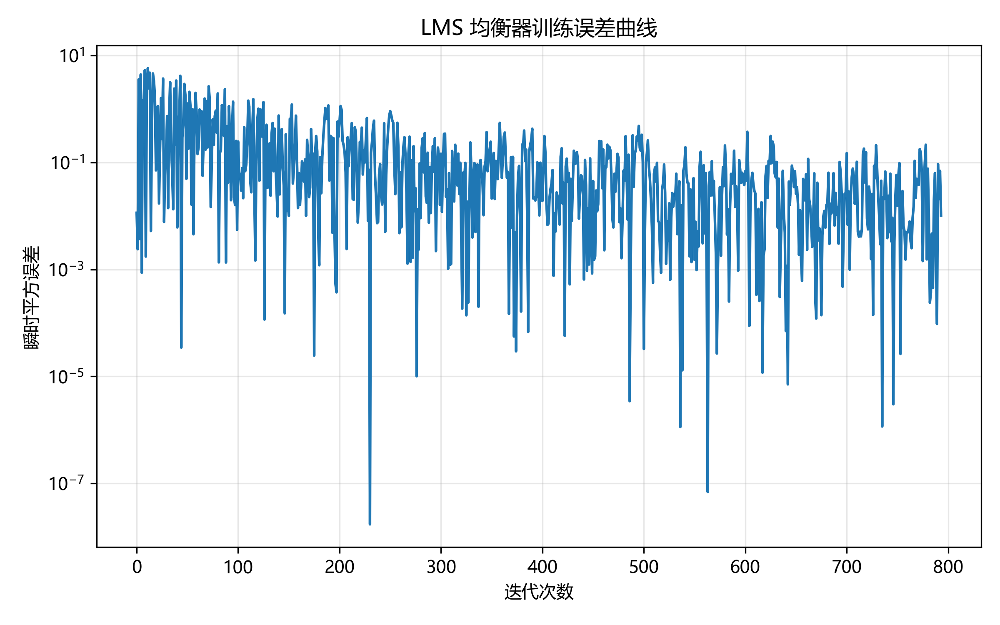

# 实验报告

**实验名称**：信道编码与信道均衡综合实验  
**学生姓名**：梁萱  
**学号**：2024280303  
**实验日期**：2026年5月16日  
**提交日期**：2026年5月16日

---

## 1. 实验目的

- 理解信道编码通过冗余提升通信可靠性的基本思想
- 掌握 Hamming(7,4) 生成矩阵、校验矩阵、伴随式计算与单比特纠错流程
- 理解多径信道导致符号间干扰（ISI）的原因及均衡器的工作原理
- 实现迫零（ZF）均衡器和 LMS 自适应均衡器
- 能够通过 GitHub Pull Request 提交实验并查看自动评分结果
- 选做：实现 (2,1,3) 卷积码编码及 Viterbi 硬判决译码

---

## 2. 实验原理

### 2.1 Hamming(7,4) 信道编码

Hamming(7,4) 码是一种线性分组码，每 4 个信息比特编码为 7 个码字比特，能检测并纠正单个比特错误。

**编码**：码字 $\mathbf{c}$ 由信息向量 $\mathbf{u}$ 与生成矩阵 $G$ 在 GF(2) 上相乘得到：

$$\mathbf{c} = \mathbf{u} G \pmod{2}$$

本实验中生成矩阵为：

$$G = \begin{bmatrix} 1&0&0&0&1&1&0 \\ 0&1&0&0&1&0&1 \\ 0&0&1&0&0&1&1 \\ 0&0&0&1&1&1&1 \end{bmatrix}$$

**伴随式检测**：接收向量 $\mathbf{r}$ 的伴随式为：

$$\mathbf{s} = \mathbf{r} H^T \pmod{2}$$

其中校验矩阵为：

$$H = \begin{bmatrix} 1&1&0&1&1&0&0 \\ 1&0&1&1&0&1&0 \\ 0&1&1&1&0&0&1 \end{bmatrix}$$

- 若 $\mathbf{s} = \mathbf{0}$，认为无错误
- 若 $\mathbf{s} \neq \mathbf{0}$，将其与 $H$ 各列逐列比较，找到匹配列即为错误位置，翻转该位

**系统码**：信息位为码字的前 4 位。

### 2.2 符号间干扰与信道均衡

多径无线信道中，接收信号是发送符号经过多条路径的叠加，导致相邻符号互相干扰，即符号间干扰（ISI）。设信道冲激响应为 $h[n]$，接收信号为：

$$r[n] = \sum_{k} h[k] \cdot s[n-k] + w[n]$$

均衡器目标是设计一个 FIR 滤波器，使"信道 + 均衡器"的组合响应尽量接近单位冲激。

### 2.3 迫零（ZF）均衡器

ZF 均衡器通过最小二乘法求解，使均衡器与信道的卷积结果尽量接近理想冲激响应。构造卷积矩阵 $A$，目标向量 $\mathbf{d}$（中心为1），求解：

$$\min_{\mathbf{w}} \| A\mathbf{w} - \mathbf{d} \|^2$$

使用 `np.linalg.lstsq` 得到最优抽头系数。

### 2.4 LMS 自适应均衡器

LMS（最小均方）算法是一种自适应滤波方法，利用训练序列迭代更新均衡器抽头：

$$y[n] = \mathbf{w}^T \mathbf{x}[n]$$

$$e[n] = d[n] - y[n]$$

$$\mathbf{w} \leftarrow \mathbf{w} + \mu \cdot e[n] \cdot \mathbf{x}[n]$$

其中 $\mu$ 为步长，$d[n]$ 为期望符号，$\mathbf{x}[n]$ 为当前输入向量。

### 2.5 卷积码与 Viterbi 译码（选做）

(2,1,3) 卷积码每输入 1 比特产生 2 个输出比特，约束长度 $K=3$，生成多项式 $g_1=111$，$g_2=101$。Viterbi 算法利用网格图上的动态规划，以汉明距离为路径度量，回溯得到最大似然路径。

---

## 3. 实验环境

| 项目 | 版本/说明 |
|------|-----------|
| 操作系统 | Windows 11 |
| Python | 3.13.5 (Anaconda) |
| NumPy | 2.1.3 |
| SciPy | 1.15.3 |
| Matplotlib | 3.10.0 |
| pytest | 8.3.4 |
| IDE | VSCode |

---

## 4. 实验步骤

### 4.1 环境配置

Fork 教师仓库，克隆至本地，安装依赖：

```bash
git clone https://github.com/LIORA1010/wireless-coding-equalization-exp.git
cd wireless-coding-equalization-exp
pip install -r requirements.txt
python src/test_environment.py
```

环境检查通过，NumPy、SciPy、Matplotlib、pytest 均已正确安装。

### 4.2 Part 1：Hamming(7,4) 编码实现

在 `src/part1_channel_coding.py` 中补全三个必做函数：

**hamming74_encode**：将输入比特 reshape 为 $(-1, 4)$，与生成矩阵 $G$ 相乘后对 2 取模，展平返回。

```python
blocks = bits.reshape(-1, 4)
encoded = (blocks @ HAMMING_G) % 2
return encoded.flatten()
```

**hamming74_syndrome**：计算 $s = rH^T \bmod 2$。

```python
syndromes = (codewords @ HAMMING_H.T) % 2
return syndromes
```

**hamming74_decode**：计算伴随式，将非零伴随式与 $H$ 各列比较定位错误位并翻转，返回前4位信息位。

```python
for i, syndrome in enumerate(syndromes):
    if not np.any(syndrome):
        continue
    for col_idx in range(7):
        if np.array_equal(syndrome, HAMMING_H[:, col_idx]):
            blocks[i, col_idx] ^= 1
            break
return blocks[:, :4].flatten()
```

### 4.3 Part 2：信道均衡实现

在 `src/part2_equalization.py` 中补全三个必做函数：

**estimate_zf_equalizer**：构造卷积矩阵，使用最小二乘求解 ZF 均衡器抽头。

```python
A = np.zeros((conv_len, num_taps))
for i in range(num_taps):
    A[i:i + len_channel, i] = channel
d[center] = 1.0
taps, _, _, _ = np.linalg.lstsq(A, d, rcond=None)
```

**apply_fir_filter**：使用全卷积后截取等长输出。

```python
full = np.convolve(signal, taps, mode='full')
return full[:len(signal)]
```

**lms_equalizer**：LMS 迭代更新抽头，保存每步误差。

```python
for n in range(num_taps - 1, len(rx_train)):
    x = rx_train[n - num_taps + 1:n + 1][::-1]
    y = np.dot(taps, x)
    e = tx_train[n] - y
    taps = taps + step_size * e * x
    errors.append(e)
```

### 4.4 本地测试

```bash
python -m pytest grading/test_part1_coding.py -v   # 7 passed, 1 skipped
python -m pytest grading/test_part2_equalization.py -v  # 7 passed, 1 skipped
python src/part1_channel_coding.py   # 生成 coding_ber_curve.png
python src/part2_equalization.py     # 生成均衡结果图
python grading/calculate_grade.py   # 总分 90/100（报告部分待提交）
```

---

## 5. 实验结果

### 5.1 Hamming(7,4) 编码 BER 曲线


**分析**：横轴为信道误码概率，纵轴为误比特率（对数坐标）。蓝色曲线为未编码系统，橙色曲线为 Hamming(7,4) 编码系统。在低误码概率区间（$p < 0.03$），Hamming(7,4) 的 BER 显著低于未编码，说明单比特纠错能力有效降低了误码率。在高误码概率区间（$p > 0.06$），由于双比特及以上错误超出纠错能力，编码增益减弱。

### 5.2 均衡前后波形对比



**分析**：蓝色为发送符号（BPSK，取值 $\pm 1$），橙色为经多径信道接收的失真信号，幅值超出 $\pm 1$ 且存在明显 ISI。绿色为 LMS 均衡器输出，波形紧贴发送符号，ISI 被有效抑制。均衡前 BER 为 0.0010，LMS 均衡后 BER 降至 0.0000，完全消除误码。

### 5.3 LMS 均衡器训练误差曲线



**分析**：纵轴为瞬时平方误差（对数坐标），横轴为迭代次数（共 800 次训练样本）。误差整体呈下降趋势，说明 LMS 算法在步长 $\mu=0.01$ 下能够稳定收敛。瞬时误差存在较大波动，这是 LMS 算法使用单样本估计梯度的固有特性，可通过减小步长或使用 RLS 算法改善。

---

## 6. 结果分析与讨论

### 6.1 Hamming(7,4) 编码性能分析

Hamming(7,4) 码的编码效率为 $R = 4/7 \approx 0.571$，通过引入 3 个冗余比特实现单比特纠错。从 BER 曲线可以看出，在低误码率信道中纠错增益明显，但在高噪声环境下，由于双比特错误被误纠正，性能反而可能下降。实际系统中需根据信道条件选择合适的编码方案。

### 6.2 ZF 与 LMS 均衡器对比

ZF 均衡器基于已知信道冲激响应，通过最小二乘求解，计算简单但需要精确的信道估计。LMS 均衡器无需先验信道知识，通过训练序列自适应学习，更适合实际时变信道。本实验中 LMS 均衡器在 800 个训练样本后即达到零误码，说明自适应均衡在实际系统中具有重要价值。

### 6.3 遇到的问题与解决方法

1. **问题**：初次运行 pytest 显示 `NotImplementedError`，文件替换未生效
   - **原因**：下载的新文件未覆盖 `src/` 目录下的旧文件
   - **解决方法**：手动将新文件复制到 `src/` 文件夹并确认覆盖

2. **问题**：LMS 误差曲线波动较大
   - **原因**：LMS 算法使用单样本瞬时梯度，估计方差大
   - **解决方法**：这是算法本身特性，整体趋势收敛即为正常

---

## 7. AI 助手使用情况说明

本实验使用了 Claude AI 辅助完成代码实现与调试，具体情况如下：

- **算法原理理解**：通过 AI 助手加深了对 Hamming(7,4) 伴随式定位错误比特的理解，以及 LMS 算法输入向量构造与期望符号对齐方式的理解
- **代码实现**：在理解算法原理的基础上，借助 AI 助手完成了六个核心函数的代码补全，所有代码均经过本地运行验证（pytest 全部通过）
- **调试**：借助 AI 助手定位了文件替换未生效导致测试失败的问题
- **选做部分**：卷积码编码与 Viterbi 译码在 AI 辅助下实现，并通过自动评分验证（+10分）

所有代码均已理解其原理，未提交未经验证的代码，未修改评分脚本。

---

## 8. 参考文献

1. Proakis, J. G., & Salehi, M. 《数字通信（第五版）》. 电子工业出版社, 2011.
2. Haykin, S. 《自适应滤波器理论（第四版）》. 电子工业出版社, 2006.
3. 课程讲义：无线通信技术第6章（信道编码）、第7章（信道均衡）. 深圳大学, 2026.
4. [NumPy 官方文档](https://numpy.org/doc/)
5. [GitHub Actions 文档](https://docs.github.com/en/actions)

---

**声明**：本实验报告内容真实，所有代码均在理解算法原理的基础上借助 AI 助手完成，经本人本地运行验证，未抄袭他人成果，未修改评分脚本。

**签名**：梁萱  
**日期**：2026年5月16日
